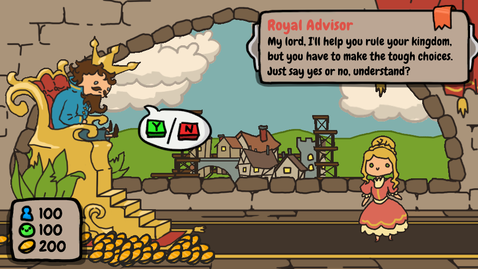
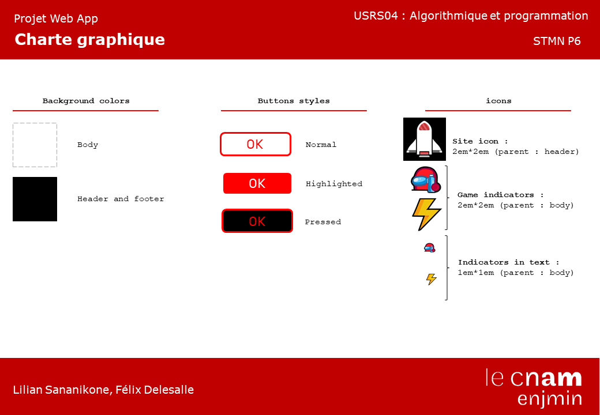
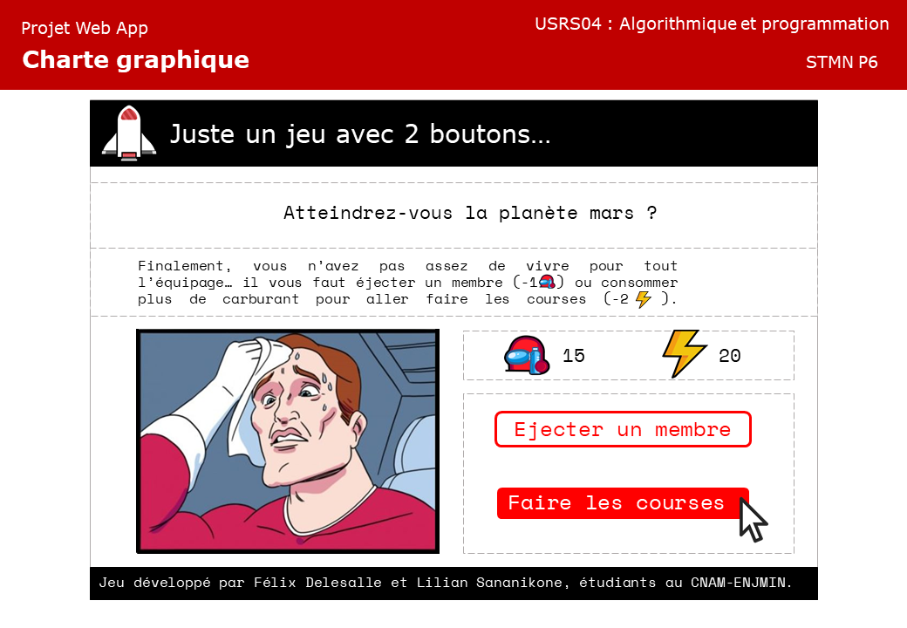

# Juste un jeu avec 2 boutons
## Récupération du projet
Nous vous invitons à télécharger le projet à ce trouvant à cette adresse :
```
https://github.com/LS79370/Button
```
Pour le bon fonctionnement du projet, vous devez installer des dépendances à l'aide de la commande ci-dessous (avec installation de Node.js au préalable) :
```
npm install
```
Vous pouvez ensuite lancer le projet avec la commande ci-après, vous le retrouverez sur http://localhost:8080/ :
```
npm run serve
```
### L'Idée...
L'idée était de de quelque chose qui nous amusait, le meme avec la personne devant un choix difficile : 2 boutons !

Vous trouverez un exemple ci-dessous.

#### Le Jeu
Nous avons donc décider de nous réinterpréter cette image au sein d'un jeu en ligne :

vous êtes le capitaine d'une navette spatiale en route vers Mars et à l'aide de 2 boutons, vous devez faire des choix difficiles pour arriver à destination avec un vaisseau en bon état et un équipage le plus complet possible...
#### L'Inspiration
Le jeu *Sort the court* est notre principale inspiration. Dans ce jeu, vous dirigez un royaume et devez sacrifiez des ressources pour faire en sorte que votre royaume ne s'effondre pas.

Dans notre jeu, vous devez alterner entre sacrifier **des membres de votre équipage** ou **des parties de votre vaisseau** le temps d'un trajet vers Mars, le but étant d'arriver sur la planète dans un vaisseau (pas forcément entier) et avec une équipe (plus ou moins réduite).
### Un petit plus
Nous avons eu l'idée d'ajouter un joker dans le jeu, à utilisation unique ! Il vous permettra de passer une des péripéties les plus difficiles !
Il s'agit d'un 3e bouton, mais bon... les gros boutons rouges, c'était déjà pris !
#### Comment ?
Ainsi, nous n'utiliserons pas de bouton pour ce joker mais une puce... non pas une puce d'un marchien,  une puce **NFC** !
Si l'appareil que vous utilisez (téléphone, tablette, ordinateur...) est compatible au **NFC**, il vous suffit de scanner la puce avec votre appareil pour utiliser le joker.

Cela nécessite en revanche de programmer la puce au préalable pour l'utiliser. (Comme pour les piles, c'est pas fourni ! )
#### Programmer une puce NFC
### Notre charte graphique
#### Mon 1er est un ensemble d'images et de couleurs...

#### Mon 2e est du texte...

#### Mon tout a une version desktop...

#### Et une version mobile...
