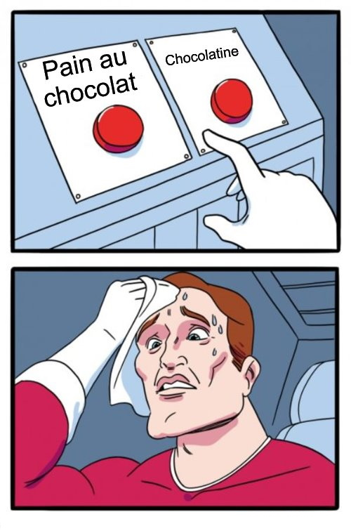
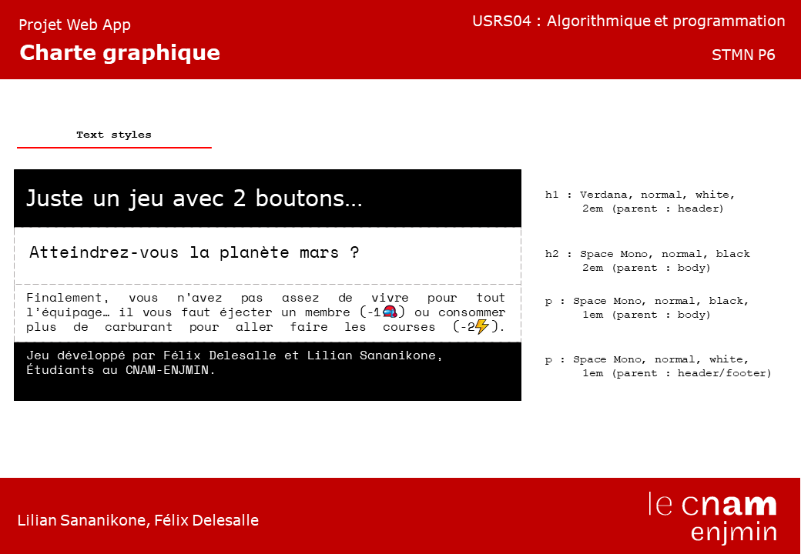
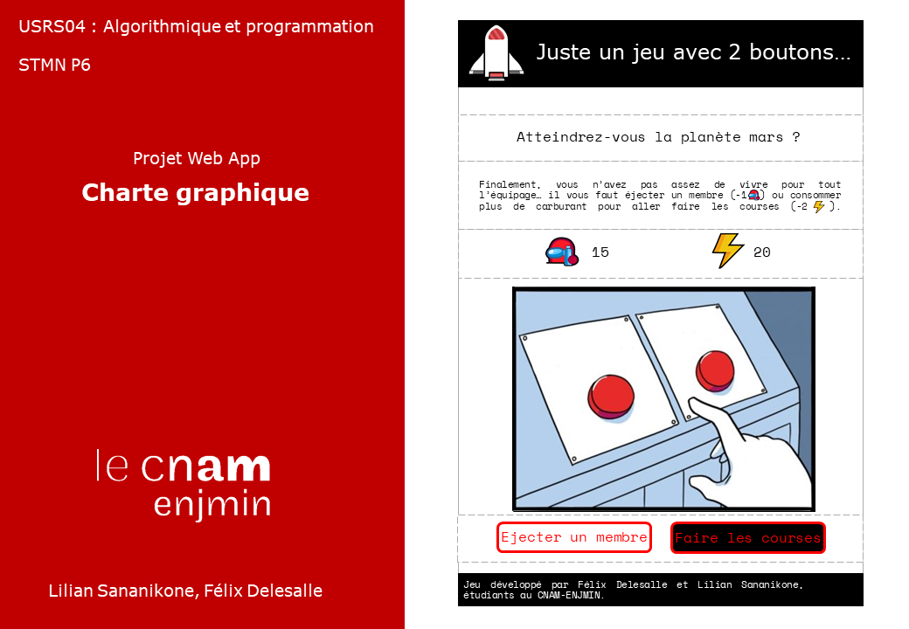

# Juste un jeu avec 2 boutons
## R�cup�ration du projet
Nous vous invitons � t�l�charger le projet web � ce trouvant � cette adresse :
```
https://github.com/LS79370/Button
```
Pour le bon fonctionnement du projet, vous devez installer des d�pendances � l'aide de la commande ci-dessous (avec installation de Node.js au pr�alable) :
```
npm install
```
Vous pouvez ensuite lancer le projet avec la commande ci-apr�s, vous le retrouverez sur http://localhost:8080/ :
```
npm run serve
```
Vous pouvez sinon aller sur le site � cette adresse : https://just-a-game-with-2-buttons.netlify.app/.
### L'Id�e...
L'id�e �tait de de quelque chose qui nous amusait, le meme avec la personne devant un choix difficile : 2 boutons !
Vous trouverez un exemple ci-dessous.


#### Le Jeu
Nous avons donc d�cider de nous r�interpr�ter cette image au sein d'un jeu en ligne :

vous �tes le capitaine d'une navette spatiale en route vers Mars et � l'aide de 2 boutons, vous devez faire des choix difficiles pour arriver � destination avec un vaisseau en bon �tat et un �quipage le plus complet possible...
#### L'Inspiration
Le jeu *Sort the court* est notre principale inspiration. Dans ce jeu, vous dirigez un royaume et devez sacrifiez des ressources pour faire en sorte que votre royaume ne s'effondre pas.


Dans notre jeu, vous devez alterner entre sacrifier **des membres de votre �quipage** ou **des parties de votre vaisseau** le temps d'un trajet vers Mars, le but �tant d'arriver sur la plan�te dans un vaisseau (pas forc�ment entier) et avec une �quipe (plus ou moins r�duite).
### Un petit plus
Nous avons eu l'id�e d'ajouter un joker dans le jeu, � utilisation unique ! Il vous permettra de passer une des p�rip�ties les plus difficiles !
Il s'agit d'un 3e bouton, mais bon... les gros boutons rouges, c'�tait d�j� pris !
#### Comment ?
Ainsi, nous n'utiliserons pas de bouton pour ce joker mais une puce... non pas une puce d'un marchien,  une puce **NFC** !
Si l'appareil que vous utilisez (t�l�phone, tablette, ordinateur...) est compatible au **NFC**, il vous suffit de scanner la puce avec votre appareil pour utiliser le joker.

Cela n�cessite en revanche de programmer la puce au pr�alable pour l'utiliser. (Comme pour les piles, c'est pas fourni ! )
#### Programmer une puce NFC
<<<<<<< HEAD
Pour programmer la puce, il vous faut un lecteur NFC compatible comme **NFC Tools** sur Android ou sur PC. Dans NFC Tools par exemple, il faut s�lectionner l'option "**ajouter un enregistrement**", puis celle de "**Texte**". Ensuite, il suffit d'**�crire le message 'skip'**, puis cliquer sur "**Ecrire**" et passer la puce sur le lecteur. L'application �crit dans la puce le texte 'skip'. 
Ce mot de passe sera utilis� pour **lancer la fonction de joker**. Une fois ceci fait, votre puce est pr�te. Vous pouvez commencer � jouer, et si un �venement est trop difficile, il suffit juste de scanner la puce.
L'�venement en question est pass� gr�ce au joker, ce qui vous permet de ne pas payer les co�ts de celui-ci. Evidemment, vous ne pourrez utiliser ce joker qu'une seule fois.
=======
Pour programmer la puce, il vous faut un lecteur NFC compatible comme **NFC Tools** sur Android ou sur PC. Dans NFC Tools par exemple, il faut sélectionner l'option "**ajouter un enregistrement**", puis celle de "**Texte**". Ensuite, il suffit d'**écrire le message 'skip'**, puis cliquer sur "**Ecrire**" et passer la puce sur le lecteur. L'application écrit dans la puce le texte 'skip'. 
Ce mot de passe sera utilisé pour **lancer la fonction de joker**. Une fois ceci fait, votre puce est prête. Vous pouvez commencer à jouer, et si un évenement est trop difficile, il suffit juste de scanner la puce.
L'évenement en question est passé grâce au joker, ce qui vous permet de ne pas payer les coûts de celui-ci. Evidemment, vous ne pourrez utiliser ce joker qu'une seule fois.
>>>>>>> main
### Notre charte graphique
#### Mon 1er est un ensemble d'images et de couleurs...

#### Mon 2nd est du texte...

#### Mon tout a une version desktop...

#### Et une version mobile !
